# 🎵 Playlist Maker

**Playlist Maker** — Android-приложение для поиска треков и создания музыкальных плейлистов. Проект учитывает современный подход к разработке мобильных приложений: чистая архитектура, разделение на модули, Jetpack Compose и грамотная работа с данными (сеть + локальная база).

## 📱 Возможности

- 📂 Создание и управление плейлистами
- 🔎 Поиск треков через сетевой API
- 💾 Сохранение информации в локальной базе данных
- 📜 Просмотр истории поисковых запросов
- 🌗 Поддержка светлой и темной темы
- 🌍 Локализация на русский и английский языки
- ⚙️ Удобная и стабильная сборка через Gradle

---

## 🖼️ Скриншоты

| 
**Главная**
 | 
**Поиск**
 | 
**Экран трека**
 |
|:--:|:--:|:--:|
|   | 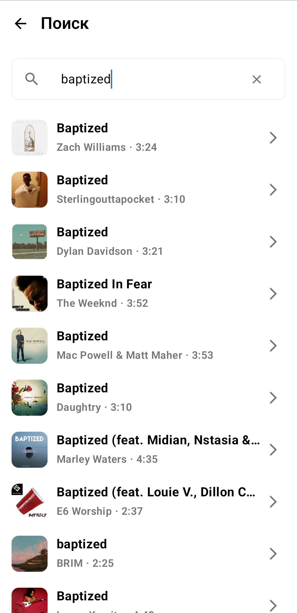 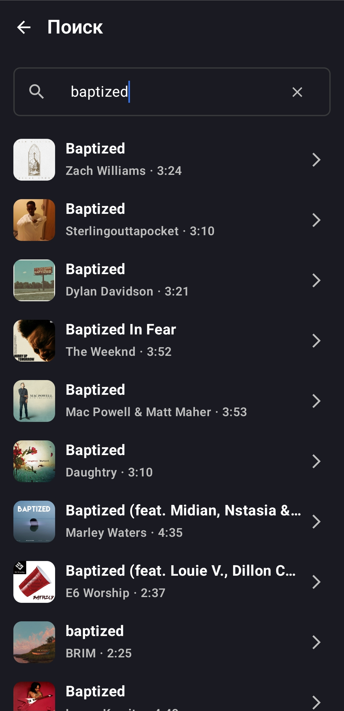 | 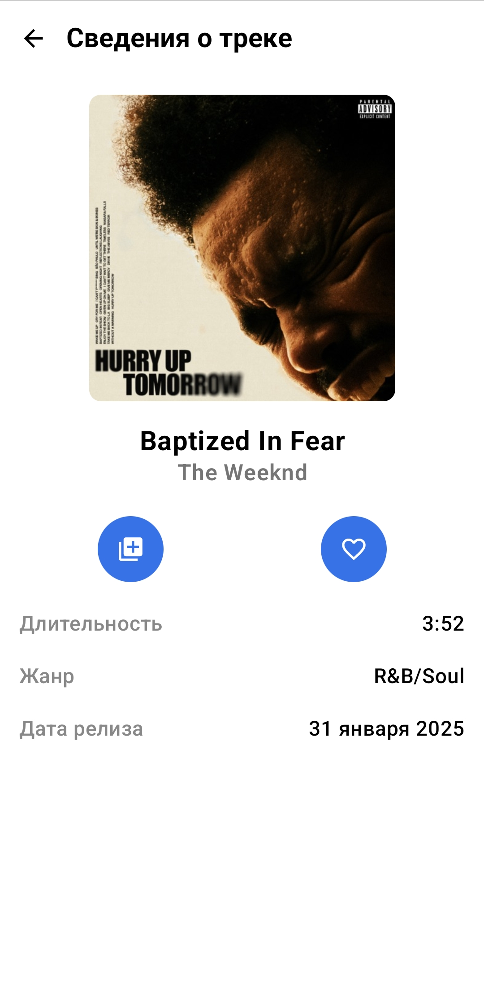 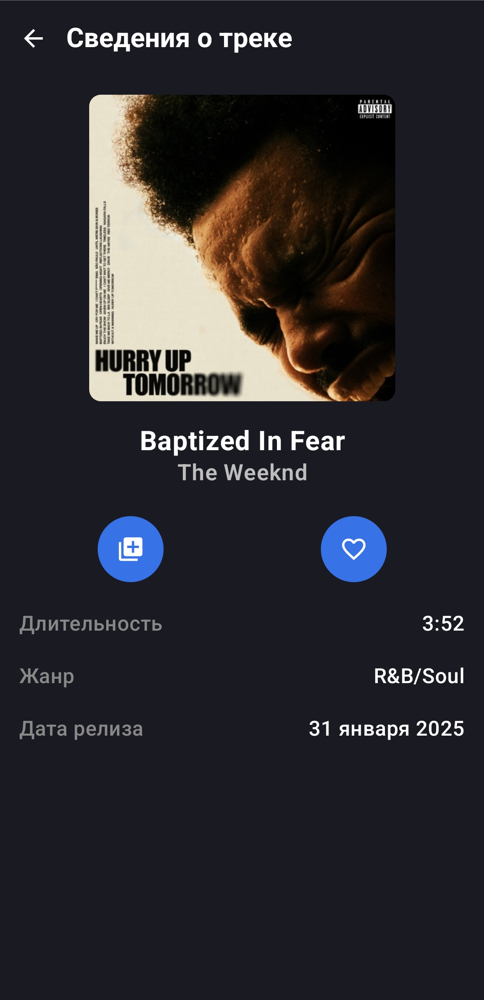 |
| 
**Экран трека**
 | 
**Добавление трека**
 | 
**Список плейлистов**
 |
|   | 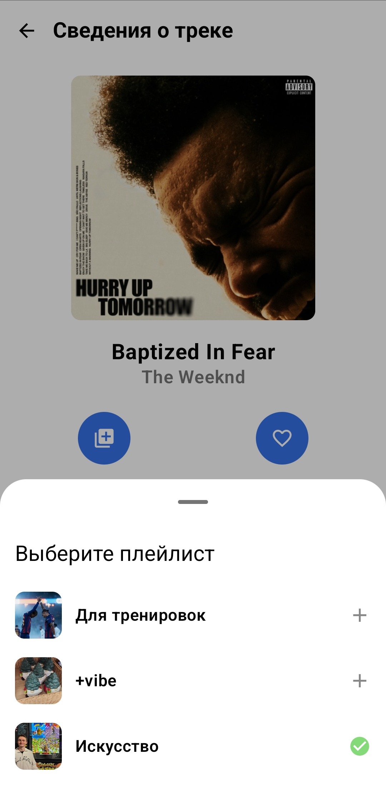  | 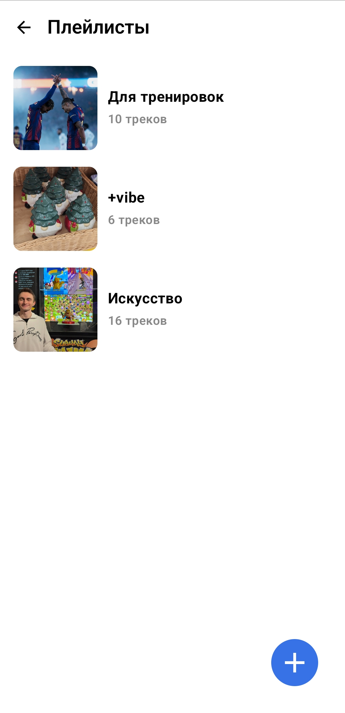 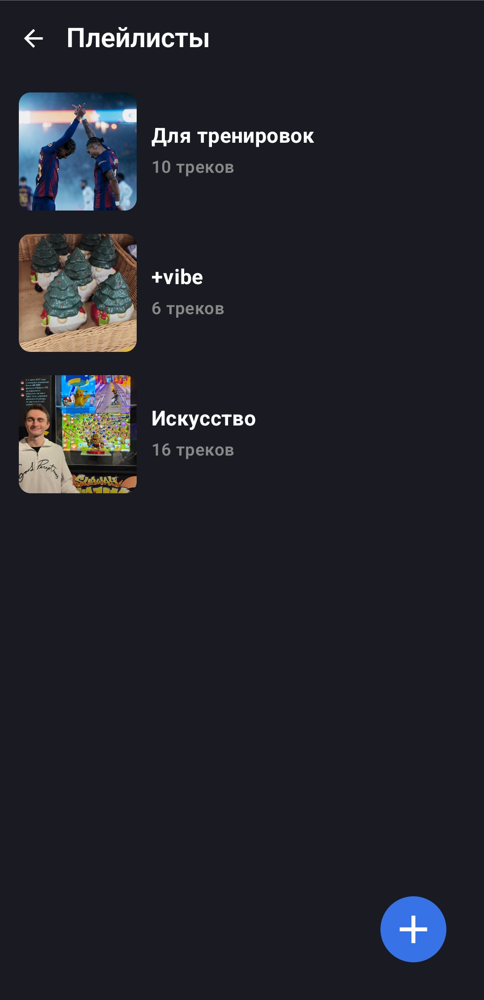 |
| 
**Создание плейлиста**
 | 
**Экран плейлиста**
 | 
**Параметры плейлиста**
 |
| 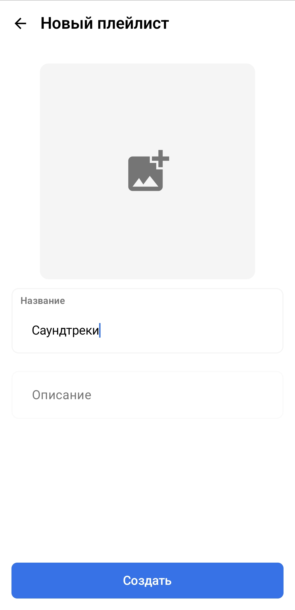 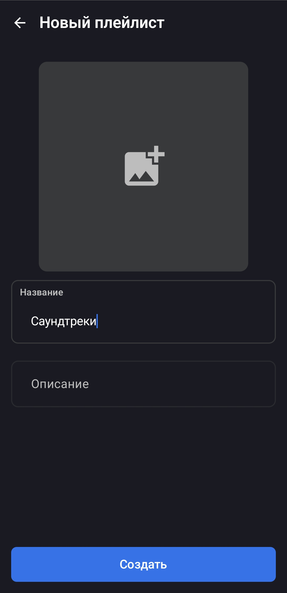 | 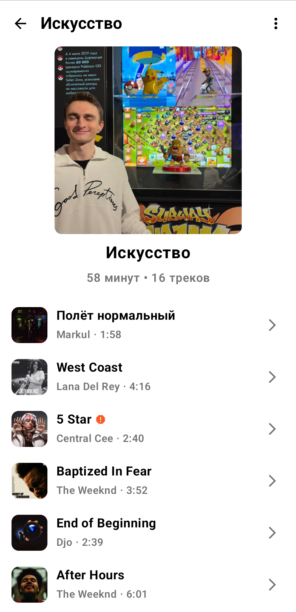 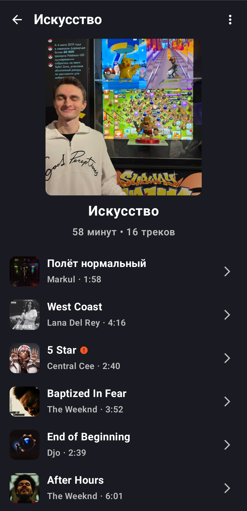 |   |
| 
**Избранное**
 | 
**Настройки**
 |  |
| 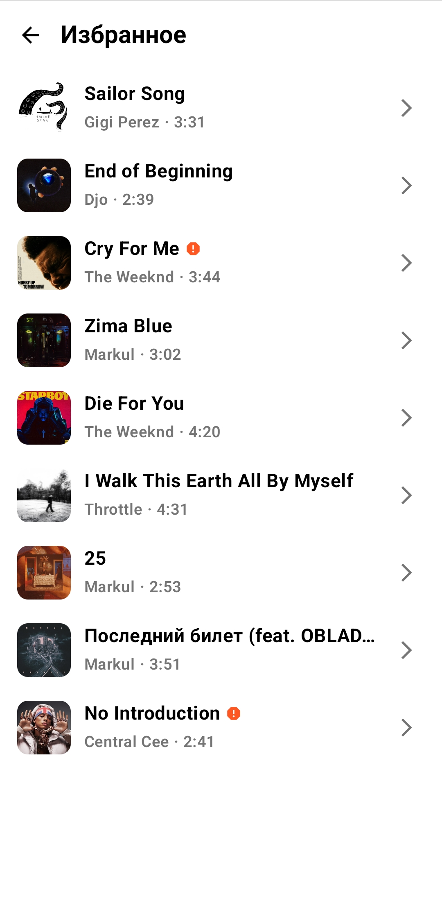 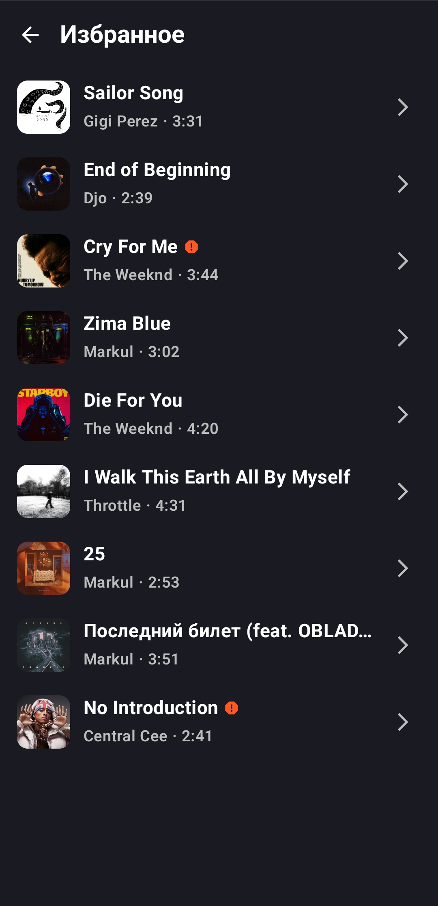 |  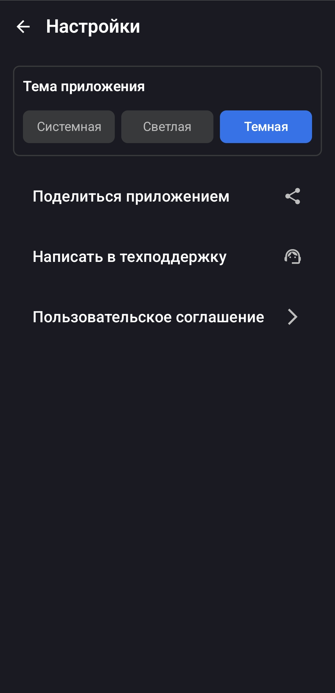 |

---

## 🛠️ Технологии и архитектура

| Технология / Паттерн | Назначение |
|------------------------|------------|
| **Kotlin** | Язык разработки приложения |
| **Clean Architecture + MVVM** | Организация кода и разделение ответственности |
| **Jetpack Compose** | Построение современного интерфейса |
| **Navigation Component (Single Activity)** | Управление переходами между экранами в рамках одной MainActivity |
| **Room Database** | Локальное хранение плейлистов, треков, истории и избранного |
| **Gradle (Kotlin DSL)** | Автоматизация сборки и управления зависимостями |

---

## 🚀 Как запустить (APK файл)

Скачать готовый установочный файл можно здесь:

👉 **[Скачать APK](https://github.com/datogavvr/playlist-maker/releases/latest)**

